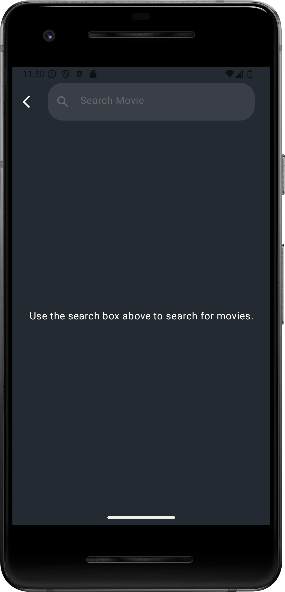

<h1 align="center">:clapper:CineVibe - Movie App</h1>

<p align="center">
  <a href="https://github.com/omerfaruksekmen"></a>
  
  
  
</p>

<p align="center">
  CineVibe is a comprehensive movie application that uses modern architectural designs and the latest Android technologies.
  It is developed with Jetpack Compose and built on the MVVM architecture. Web services (APIs) are integrated via Retrofit for internet-based operations. Additionally,
  Room database is used for local-based operations.
</p>

## :camera_flash: Screenshots

<table style="width: 100%; table-layout: fixed;">
  <tr>
    <th style="text-align: center; border: none;">Home Page</th>
    <th style="text-align: center; border: none;">Movie Detail Page</th>
    <th style="text-align: center; border: none;">Cart Page</th>
  </tr>
  <tr>
    <td style="height: 300px; width: 33.33%; text-align: center; border: none;">
      
    </td>
    <td style="height: 300px; width: 33.33%; text-align: center; border: none;">
      
    </td>
    <td style="height: 300px; width: 33.33%; text-align: center; border: none;">
      
    </td>
  </tr>
  <tr>
    <th style="text-align: center; border: none;">Favorites Page</th>
    <th style="text-align: center; border: none;">Search Page</th>
    <th style="text-align: center; border: none;">Add To Cart</th>
  </tr>
  <tr>
    <td style="height: 300px; width: 33.33%; text-align: center; border: none;">
      
    </td>
    <td style="height: 300px; width: 33.33%; text-align: center; border: none;">
      
    </td>
    <td style="height: 300px; width: 33.33%; text-align: center; border: none;">
      
    </td>
  </tr>
  <tr>
    <th style="text-align: center; border: none;">Delete Product</th>
    <th style="text-align: center; border: none;">Add Favorite</th>
    <th style="text-align: center; border: none;">Empty Cart</th>
  </tr>
  <tr>
    <td style="height: 300px; width: 33.33%; text-align: center; border: none;">
      
    </td>
    <td style="height: 300px; width: 33.33%; text-align: center; border: none;">
      
    </td>
    <td style="height: 300px; width: 33.33%; text-align: center; border: none;">
      
    </td>
  </tr>
  <tr>
    <th style="text-align: center; border: none;">Empty Favorites</th>
    <th style="text-align: center; border: none;">Empty Search</th>
  </tr>
  <tr>
    <td style="height: 300px; width: 33.33%; text-align: center; border: none;">
      
    </td>
    <td style="height: 300px; width: 33.33%; text-align: center; border: none;">
      
    </td>
  </tr>
</table>


## 📁 Project Structure

```
com.omerfaruksekmen.cinevibe
├── 📁 data                 # Data layer
│   ├── 📁 entity           # Data models and response classes
│   ├── 📁 datasource       # Data sources and the implementation of MoviesDataSource
│   └── 📁 repo             # Repository pattern and the implementation of MoviesRepository
│
├── 📁 di                   # Dependency injection modules for Hilt, Application and database dependencies
│
├── 📁 retrofit             # Interfaces and utility classes for API requests, RetrofitClient configuration
│
├── 📁 room                 # Local database configuration, DAO (Data Access Object) operations
│
└── 📁 ui                   # UI layer
    ├── 📁 screen           # Screens created with Jetpack Compose and Navigation configuration
    ├── 📁 viewmodel        # ViewModels for MVVM architecture
    └── 📁 theme            # UI theme and style definitions
```

## :hammer_and_wrench: Technologies
- Minimum SDK Level 24
- Kotlin
- Jetpack Compose
- Architecture: MVVM, Clean Architecture, Repository Pattern
- Dependency Injection: Dagger Hilt
- Jetpack Components: Navigation, ViewModel, LiveData, StateFlow, Room Database
- Networking: Retrofit, OkHttp, Gson
- Image Loading: Glide
- Asynchronous Operations: Flow, Coroutines
- Material Design 3

## :hammer: Architecture


## :movie_camera: Watch the Demo

[](https://youtube.com/shorts/hKmLbNymcP8?feature=share)

## :question: How To Run ?

In the **CartPage**, **MovieDetailPage**, and **CartPageViewModel**, you need to enter a username of your choice in the field labeled

```"Enter your username here."```

The API takes the username as a parameter and performs operations such as adding to the cart,
removing items, and listing the products in the cart accordingly. If you prefer, you can manage the username dynamically using session management.

**:bangbang: Warning:** All usernames in the relevant fields must be the same
